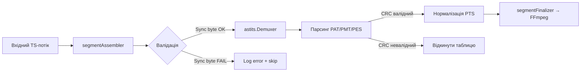

# Глибоке роз'яснення: Генератор CRC32 таблиці для astits

Цей файл — **код-генератор**, який створює оптимізовану lookup-таблицю для обчислення CRC32 за поліномом MPEG-2 (`0x04c11db7`). Він використовується бібліотекою `astits` для швидкої валідації цілісності TS-пакетів.

---

## 🎯 Навіщо це потрібно?

```
┌─────────────────────────────────────────┐
│ CRC32 у MPEG-TS:                        │
│ • Кожен TS-пакет (188 байт) має 4-байт  │
│   CRC у адаптаційному полі або таблицях │
│ • Перевірка цілісності PAT/PMT/SDT/EIT  │
│ • Виявлення пошкоджених пакетів         │
└─────────────────────────────────────────┘
```

**Проблема**: Обчислювати CRC32 "на льоту" для кожного байта — повільно.  
**Рішення**: Пре-обчислити таблицю з 256 значень → O(1) доступ замість O(n) обчислень.

---

## 🔧 Як працює генератор

### 1. Алгоритм побудови таблиці

```go
// Поліном MPEG-2 (CRC-32/BZIP2)
const polynomial = 0x04c11db7

for i := 0..255 {
    k = 0
    for j = (i << 24) | 0x800000; j != 0x80000000; j <<= 1 {
        if (k^j) & 0x80000000 != 0 {
            k = (k << 1) ^ polynomial  // XOR з поліномом
        } else {
            k = (k << 1)               // просто зсув
        }
    }
    tableCRC32[i] = k
}
```

**Візуалізація одного ітерації (i=1):**
```
i = 1 = 0b00000001
j початкове = 0x81000000 (i<<24 | 0x800000)

Крок 1: (0^0x81000000)&0x80000000 ≠ 0 → k = (0<<1)^0x04c11db7 = 0x04c11db7
Крок 2: (0x04c11db7^0x02000000)&0x80000000 = 0 → k = 0x04c11db7<<1 = 0x09823b6e
...
Після 32 ітерацій: tableCRC32[1] = 0xF7D189FD
```

### 2. Формат виводу

Генератор створює файл `crc32_table.go`:

```go
// Code generated by astits using internal/cmd/crc32_table. DO NOT EDIT
package astits

var tableCRC32 = [256]uint32{
	0x00000000, 0xF7D189FD, 0xF6A539F1, 0x0174B00C,
	0xF4485BEC, 0x0399D211, 0x02ED621D, 0xF53CEBE0,
	// ... ще 248 значень ...
}
```

> ⚠️ Коментар `DO NOT EDIT` — стандартна конвенція Go для авто-генерованого коду.

---

## 🚀 Як використовувати

### Варіант 1: Запустити генератор (рідко потрібно)

```bash
# Перейти в директорію з генератором
cd internal/cmd/crc32_table

# Запустити
go run main.go

# Перевірити результат
cat crc32_table.go
```

**Результат**: Файл з'явиться в поточній директорії. Перемістіть його в корінь пакету:
```bash
mv crc32_table.go ../../
```

### Варіант 2: Використовувати готову таблицю (стандартний сценарій)

Більшість користувачів **не запускають генератор** — таблиця вже включена в репозиторій:

```go
import "github.com/asticode/go-astits"

// Бібліотека автоматично використовує tableCRC32 внутрішньо
dmx := astits.NewDemuxer(ctx, reader)
// CRC перевірки відбуваються прозоро при парсингу PSI/SI таблиць
```

### Варіант 3: Використати CRC32 у власному коді

Якщо потрібно обчислити CRC32 для TS-даних самостійно:

```go
// crc32_mpeg2.go у вашому проекті
package yourpkg

import "github.com/asticode/go-astits"

// astits не експортує tableCRC32, тому скопіюйте логіку:
func crc32MPEG2(data []byte) uint32 {
    crc := ^uint32(0)
    for _, b := range data {
        crc = (crc << 8) ^ tableCRC32[(crc>>24)^uint32(b)]
    }
    return ^crc
}

// Таблиця (скорочена версія — повну візьміть з crc32_table.go)
var tableCRC32 = [256]uint32{
    0x00000000, 0xF7D189FD, 0xF6A539F1, 0x0174B00C,
    // ...
}
```

---

## 🔍 Інтеграція з вашим HLS/CCTV пайплайном

Оскільки ви працюєте з TS-сегментами, CRC32 може бути корисним для:

### ✅ Валідація цілісності сегментів перед обробкою

```go
// segmentFinalizer.go
func validateTSSegment(data []byte) error {
    if len(data) % 188 != 0 {
        return fmt.Errorf("invalid TS length: %d", len(data))
    }
    
    for i := 0; i < len(data); i += 188 {
        packet := data[i : i+188]
        if packet[0] != 0x47 { // Sync byte
            return fmt.Errorf("missing sync byte at offset %d", i)
        }
        
        // Опціонально: перевірка CRC для адаптаційного поля
        // (реалізація залежить від структури пакета)
    }
    return nil
}
```

### ✅ Детекція пошкоджених PSI-таблиць

```go
// При парсингу PAT/PMT через astits:
dmx := astits.NewDemuxer(ctx, bytes.NewReader(tsData))
for {
    d, err := dmx.NextData()
    if err != nil { break }
    
    if d.PAT != nil {
        // astits вже перевірив CRC внутрішньо
        // Якщо дійшли сюди — PAT валідний
        log.Printf("Valid PAT: TS ID=%d", d.PAT.TransportStreamID)
    }
}
```

### ✅ Логування статистики помилок для Prometheus

```go
// У вашому monitoring.Monitor:
type Metrics struct {
    TSCRCFailures *prometheus.CounterVec
}

// При обробці:
if err := validateTSSegment(segment); err != nil {
    metrics.TSCRCFailures.WithLabelValues(channelID).Inc()
    // вирішити: відкинути сегмент / спробувати відновити
}
```

---

## 🧮 Математика CRC32 MPEG-2

### Поліном та параметри

| Параметр | Значення | Опис |
|----------|----------|--------|
| Поліном | `0x04c11db7` | MPEG-2 (також відомий як CRC-32/BZIP2) |
| Початкове значення | `0xFFFFFFFF` | Invert перед обчисленням |
| Фінальне XOR | `0xFFFFFFFF` | Invert після обчислення |
| Вхід/вихід | не інвертуються | No reflection |

### Порівняння з іншими CRC32

```go
// Стандартний CRC32 (IEEE 802.3) — використовується в Ethernet, gzip
polyIEEE = 0xEDB88320  // reflected

// MPEG-2 CRC32 — використовується в DVB/ATSC
polyMPEG = 0x04c11db7  // не reflected

// Приклад: обчислення для байта 0x01
crcIEEE := crc32.NewIEEE().Sum([]byte{0x01})     // 0x7E1A66C1
crcMPEG := crc32MPEG2([]byte{0x01})              // 0xF7D189FD (різний результат!)
```

> ⚠️ **Важливо**: Не плутайте поліноми! Використання неправильного CRC призведе до хибних відкидань валідних пакетів.

---

## 🐛 Поширені проблеми

| Проблема | Причина | Рішення |
|----------|---------|---------|
| `tableCRC32 not defined` | Файл не згенеровано / не скопійовано | Запустіть `go run main.go` у `internal/cmd/crc32_table` |
| Невірні CRC перевірки | Використано інший поліном | Переконайтесь, що використовуєте `0x04c11db7`, а не `0xEDB88320` |
| Повільна генерація | 256×32 ітерацій — це ~8000 операцій | Генеруйте один раз, коміть результат у репозиторій |
| `DO NOT EDIT` ігнорується | Ручні зміни перезапишуться при оновленні | Змінюйте логіку у генераторі, а не у вихідному файлі |

---

## 🛠️ Модифікація під ваші потреби

### Додати експорт таблиці (якщо потрібно ззовні)

```go
// У crc32_table.go після генерації:
// ExportTable returns the CRC32 MPEG-2 lookup table (for advanced use)
func ExportTable() *[256]uint32 {
    return &tableCRC32
}
```

### Підтримка кількох поліномів

```go
// У генераторі додати параметр:
var polynomial = flag.Uint64("poly", 0x04c11db7, "CRC polynomial")

// У generateTable():
poly := uint32(*polynomial)
if (k^j)&0x80000000 != 0 {
    k = (k << 1) ^ poly  // динамічний поліном
}
```

### Оптимізація для ARM/NEON

Якщо ваш CCTV-сервер працює на ARM (Raspberry Pi, Jetson):
```go
// +build arm64
// crc32_arm64.go — використати апаратну інструкцію CRC32
func crc32MPEG2(data []byte) uint32 {
    // ARMv8 має інструкцію CRC32B/CRC32W
    // Реалізація через assembly або compiler intrinsics
}
```

---

## 📦 Повний workflow для вашого проекту



---

## 📚 Довідка

- [CRC-32 варіанти (reveng)](http://reveng.sourceforge.net/crc-catalogue/all.htm)
- [MPEG-2 Systems Specification (ISO/IEC 13818-1)](https://www.iso.org/standard/61236.html)
- [astits source code](https://github.com/asticode/go-astits/blob/master/crc32.go)

> 💡 **Порада**: Для вашого пайплайну найчастіше достатньо використовувати `astits.Demuxer` "з коробки" — він вже інтегрує CRC-перевірки. Генератор таблиці потрібен лише якщо ви форкаєте бібліотеку або реалізуєте власний TS-парсер.

Якщо потрібна допомога з інтеграцією валідації CRC у ваш `segmentFinalizer` або налаштуванням метрик для моніторингу помилок — дайте знати! 🛠️